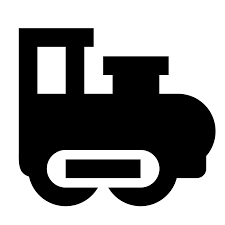

  [![Contributors][contributors-shield]][contributors-url] [![Forks][forks-shield]][forks-url] [![Stargazers][stars-shield]][stars-url] [![Issues][issues-shield]][issues-url] [![MIT License][license-shield]][license-url] [![LinkedIn][linkedin-shield]][linkedin-url]

<!-- PROJECT LOGO -->
<br />

<p align="center">
  <a href="https://github.com/vineeths96/TDOA-Localization">
    
  </a>
  <h3 align="center">TDOA Localization</h3>
  <p align="center">
    Time Dealy Of Arrival (TDOA) Localization of IISc Transvahan
    <br />
    <a href=https://github.com/vineeths96/TDOA-Localization><strong>Explore the repository»</strong></a>
    <br />
    <br />
    <a href=https://github.com/vineeths96/TDOA-Localization/blob/master/Problem%20statement.pdf>View Problem Statement</a>
    <a href=https://github.com/vineeths96/TDOA-Localization/blob/master/results/report.pdf>View Report</a>
  </p>


</p>

> tags : tdoa, ranging, estimation, multilateration, crlb, mle, blue, triangulation


<!-- ABOUT THE PROJECT -->
## About The Project

This project deals with developing different estimators to localize Transvahan - the e-vehicle on IISc Campus using measurements from receivers at four different locations in IISc and implementing and evaluating the performance of the estimators that we have derived. The Transvahan emits a beacon and each of the four anchors measure the time-of-arrival of the beacon signal. Based on these time-of-arrival measurements, we would like to find the
location of the Transvahan.

We theoretically lower bound the variance of the estimator with Cramer-Rao Lower Bound.  We also derive and implement the Maximum Likelihood Estimator (MLE) and Best Linear Unbiased Estimator (BLUE) and evaluate their performance.

### Built With
This project was built with 

* python v3.7
* The list of libraries used for developing this project is available at [requirements.txt](requirements.txt).


<!-- GETTING STARTED -->

## Getting Started

Clone the repository into a local machine using

```shell
git clone https://github.com/vineeths96/TDOA-Localization
```

### Prerequisites

Please install required libraries by running the following command (preferably within a virtual environment).

```shell
pip install -r requirements.txt
```


### Instructions to run

The `main.py` is the interface to the program. The `main.py` will make all the necessary function calls to estimate the Transvahan location using MLE and BLUE and mark it on the map. It also takes care of evaluating the performance of the estimators by plotting the MSE variation with noise variance. The program can be executed by

```shell
python main.py
```


<!-- LICENSE -->

## License

Distributed under the MIT License. See `LICENSE` for more information.


<!-- CONTACT -->
## Contact

Vineeth S - vs96codes@gmail.com

Project Link: [https://github.com/vineeths96/TDOA-Localization](https://github.com/vineeths96/TDOA-Localization)


<!-- MARKDOWN LINKS & IMAGES -->
<!-- https://www.markdownguide.org/basic-syntax/#reference-style-links -->

[contributors-shield]: https://img.shields.io/github/contributors/vineeths96/TDOA-Localization.svg?style=flat-square
[contributors-url]: https://github.com/vineeths96/TDOA-Localization/graphs/contributors
[forks-shield]: https://img.shields.io/github/forks/vineeths96/TDOA-Localization.svg?style=flat-square
[forks-url]: https://github.com/vineeths96/TDOA-Localization/network/members
[stars-shield]: https://img.shields.io/github/stars/vineeths96/TDOA-Localization.svg?style=flat-square
[stars-url]: https://github.com/vineeths96/TDOA-Localization/stargazers
[issues-shield]: https://img.shields.io/github/issues/vineeths96/TDOA-Localization.svg?style=flat-square
[issues-url]: https://github.com/vineeths96/TDOA-Localization/issues
[license-shield]: https://img.shields.io/badge/License-MIT-yellow.svg
[license-url]: https://github.com/vineeths96/TDOA-Localization/blob/master/LICENSE
[linkedin-shield]: https://img.shields.io/badge/-LinkedIn-black.svg?style=flat-square&logo=linkedin&colorB=555
[linkedin-url]: https://linkedin.com/in/vineeths

